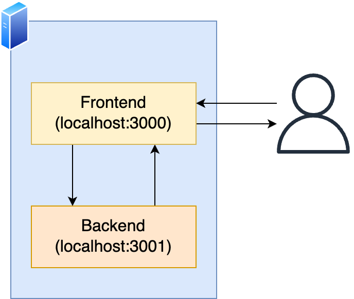

# Web Test Tutorial

This repository provides a simple backend & frontend web blog with unit test and end-to-end (e2e) test implementation



## Requirements

- node.js > 14.x

## Backend

The backend uses [koa](https://koajs.com) framework.
It does not have database, but store all items in memory.
Thus, if you restart the backend, all data will be deleted.

### How to run

- Move to the backend directory: `cd backend`
- Install dependencies and build: `npm ci`
- Run test: `npm test`
- Run server: `npm run start`
  - By default, it runs on the port 3001.
  - You can change the port by using `PORT` environment variable to change the port (e.g., `PORT=8080 npm run start`)

### APIs

The backend implementation provides three `GET` APIs and a `POST` API.

- `/list` (GET): Provides list of the stored items. If no items are stored, it returns a HTTP 400 error
- `/item` (GET): Provide a specific item. You need to provide `id` value (e.g., `/item?id=1`)
- `/flush` (GET): Delete all stored items. It makes easy to run tests.
- `/addItem` (POST): Store an item. You need to provide an item in the below format:

```
{
  "title": "Title of the item",
  "content": "Content of the item"
}
```

## Frontend

TBA

## End-to-end (E2E) Test

TBA
